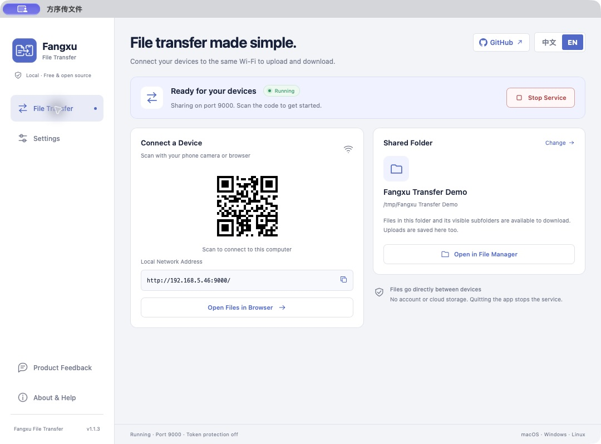
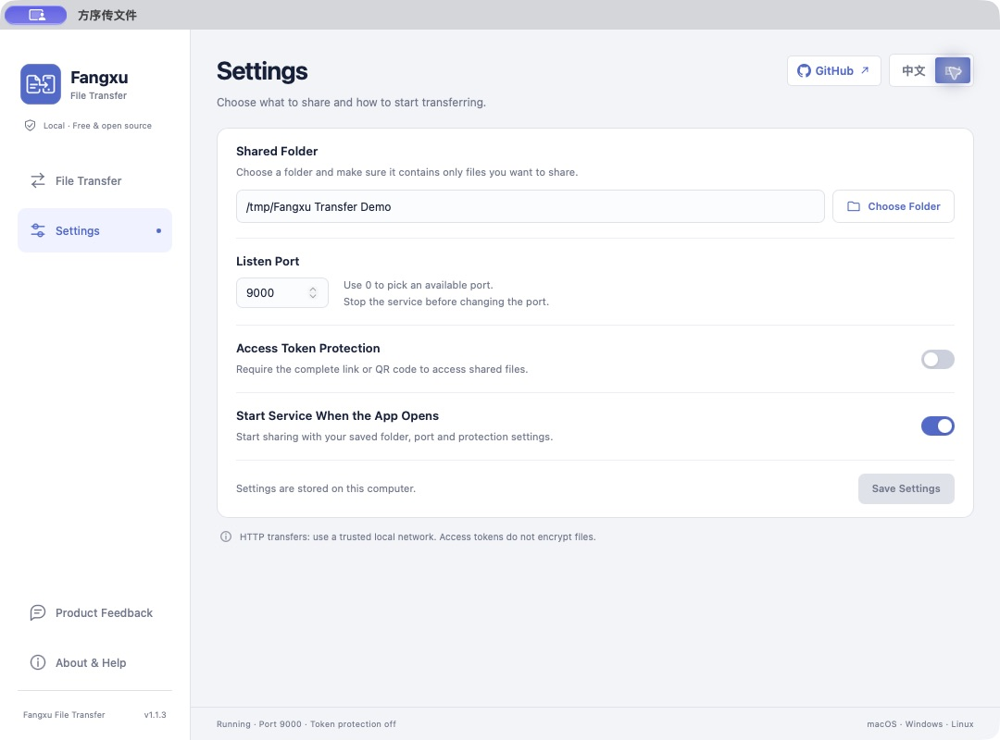
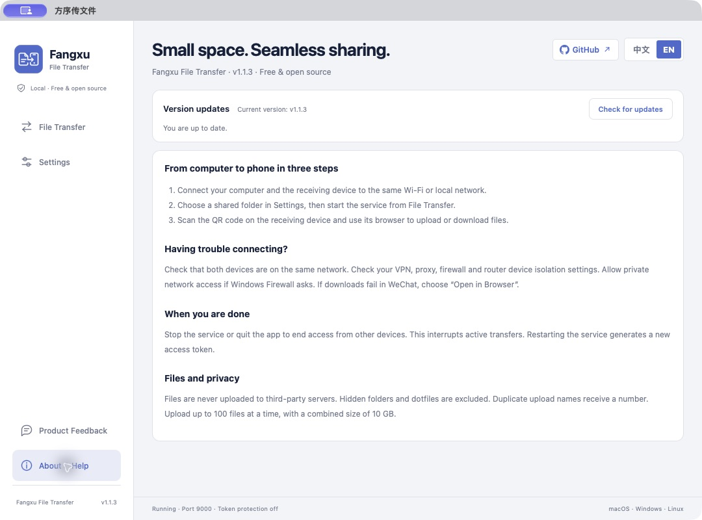
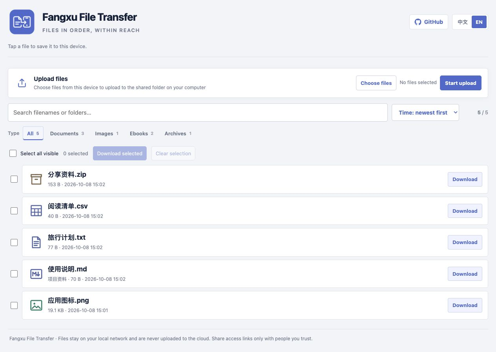

# Fangxu File Transfer（方序传文件）

[简体中文](./README.md) | **English**

[](https://go.dev/)
[](./LICENSE)

A free, open-source **cross-platform LAN file transfer tool**. Share a folder from a Windows, macOS or Linux computer. Scan a QR code on Android, iPhone or iPad to upload and download files in a browser, with no mobile app, account or cloud storage required.

Use it to transfer photos, documents, ebooks, videos and installers between your computer and phone, or temporarily share files over the same Wi-Fi network. The desktop client and file browser both support Chinese and English, with a language switch in the top-right corner.

## Download

[Download the latest desktop release](https://github.com/goldenwind/fangxu-file-transfer/releases/latest). Built with Tauri 2, each installer includes the Go transfer component. GitHub Actions builds the platform packages and publishes `SHA256SUMS.txt` for verification.

| System | Package | Launch |
| --- | --- | --- |
| Windows x86-64 | `.exe` installer | Install and launch Fangxu File Transfer |
| Windows x86-64 (portable) | `Windows-x64-portable.zip` | Extract fully and double-click `方序传文件.exe` |
| macOS 12.3+ Intel / Apple Silicon | Separate `.dmg` for each architecture | Drag to Applications and launch |
| Linux x86-64 | `.deb` / `.AppImage` | Install or run AppImage |
| Linux ARM64 | `.deb` | Install and launch |

On Windows, allow firewall access on private networks when starting the service. For unsigned macOS builds, right-click the app and choose Open if blocked. AppImage requires executable permission.

For the Windows portable edition, keep `fangxu-transfer-service.exe` beside the app and extract the entire ZIP before launching. It requires [Microsoft Edge WebView2 Runtime](https://developer.microsoft.com/microsoft-edge/webview2/); if missing, install the runtime or use the app's installer. The portable and installed editions share the user configuration directory; settings do not travel with the extracted folder.

## Quick start

1. Open the desktop client. The service starts automatically by default, sharing your user's `Downloads`.
2. Save a shared folder in Settings (`传输设置`). Set a port or token protection, or disable service auto-start.
3. Connect your devices to the same Wi-Fi. If the service is stopped, click Start service (`启动服务`). Enable token protection on networks shared with others.
4. Scan the QR code on your phone and open it in the system browser. Tap a file to download, or select multiple files to upload to your computer.
5. Click Stop service (`停止服务`) when finished, or quit the client to stop sharing automatically.

```text
Computer folder <──same Wi-Fi / HTTP──> Phone or tablet browser
```

## Screenshots

### Desktop client · File transfer

The service starts with the app by default. View its status, LAN address, QR code and shared folder. GitHub and language controls are in the top-right corner; Product Feedback is in the sidebar.



### Desktop client · Settings

Choose the shared folder, port and token protection. Service auto-start is enabled by default, and quitting the app stops sharing.



### Desktop client · About & Help

Use **Check for updates** at the top to check the stable version for your system and architecture. Connection steps, troubleshooting and privacy notes appear below. The default 1080 × 800 window displays the entire help page in either language without scrolling.



### External browser · File manager

Scan the QR code or open the LAN address to upload files, search, filter, sort or download multiple files. Chinese and English are available on the same page.



These screenshots show v1.1.3 on macOS and the browser file manager, using a dedicated sample folder and the client's default window size. The [Chinese README](./README.md#界面预览) includes the corresponding Chinese interface screenshots.

## Features

- **Two-way direct transfer:** any file type, without third-party servers. Uploads with duplicate names receive a numbered suffix instead of overwriting files.
- **Folder sharing:** subfolder scanning, Chinese filenames, search, two-level file type filters, file counts, and sorting by time or name.
- **Multiple uploads:** up to 100 files and 10 GB total per request; temporary files are cleaned up on failure. Downloads support HTTP resume.
- **Desktop controls:** choose a folder, configure port and token protection, persist auto-start preferences, and view addresses, QR codes and service status in the native window.
- **Temporary sharing:** start and stop sharing manually; quitting stops the service. A second launch focuses the existing window.
- **Batch downloads:** select individual files or all files visible after searching and filtering, then download the original files individually. Allow multiple downloads when prompted by your browser. Selections survive filter changes; use Clear selection to reset them.
- **Access tokens:** optionally restrict access to devices with the full link or new QR code. The web interface offers no deletion or renaming.

Use **Check for updates** at the top of **About & Help** to check the stable version for your system and architecture, read release notes, and open the new version download for manual installation. No sign-in is required, and the transfer service can be stopped; see the [update integration guide](./docs/updates.md).

## Product feedback

Click **Product Feedback** at the bottom of the client sidebar to open an in-app feedback window, or visit the [product feedback page](https://api.ip21.cn/products/10/feedback). The desktop entry automatically includes the app version, operating system, OS version and CPU architecture to help diagnose issues. Sign in on the webpage through the existing WeChat official-account flow, then submit a category, title, description, optional screenshot and contact email. File transfers remain free and require no account or membership. Opening feedback does not upload shared files. You can also use [GitHub Issues](https://github.com/goldenwind/fangxu-file-transfer/issues).

Reopening feedback preserves the current window's sign-in state and draft. Closing it leaves file transfers running. The feedback webpage currently uses Chinese; see the [feedback integration guide](./docs/feedback.md).


## Support & follow

Fangxu File Transfer will remain free and open source. If it saves you time, you can buy the author a coffee, give the project a Star, or share it with friends who need to transfer files between their computer and phone.

<table>
  <tr>
    <td align="center" width="33%"><strong>Alipay</strong><br><br></td>
    <td align="center" width="33%"><strong>WeChat Pay</strong><br><br></td>
    <td align="center" width="33%"><strong>Follow Yideng AI (一灯 AI)</strong><br><br></td>
  </tr>
</table>

Scan the official account QR code in WeChat for AI tools and productivity tips.

## Usage limits

- Intended for temporary transfers on trusted local networks; no remote transfer, automatic sync or backup.
- **Access token protection is off by default.** The client remembers your protection preference and generates a new token each time the service starts. Without protection, devices that can reach the service can browse, download and upload.
- Tokens restrict access but do not encrypt transfers. The service uses HTTP; avoid transferring sensitive files on public Wi-Fi.
- The shared folder and its non-hidden subfolders are accessible to visitors. Files and folders beginning with `.` are hidden. Use a dedicated folder; uploaded files also appear in the list.
- Opening a file or installing an app depends on the receiving device's supported formats and system restrictions.

## Troubleshooting

- **Phone cannot connect:** check the Wi-Fi network, VPN / proxy, firewall and router AP / client isolation settings.
- **Downloads fail in WeChat:** use the top-right menu to open the page in an external browser: Safari on iPhone or the system browser on Android.
- **Link exposed:** stop and restart the service, enable access token protection and share the new link. Restarting alone does not restrict access while protection is off.

## Run and build from source

Requires Node.js 22.12+, Go 1.22+, Rust stable and [Tauri system prerequisites](https://v2.tauri.app/start/prerequisites/):

```bash
git clone https://github.com/goldenwind/fangxu-file-transfer.git
cd fangxu-file-transfer
npm ci
npm run desktop:dev
```

Build the installer for the current operating system:

```bash
npm run desktop:build
```

Installers are in `src-tauri/target/release/bundle/`. `./build-packages.sh` invokes the same desktop build. The Go component builds automatically. GitHub Actions builds macOS Intel / Apple Silicon, Windows x64 and Linux x64 / ARM64 packages, plus a separate Windows portable ZIP. See [desktop development and packaging](./docs/desktop.md).

The original Go CLI / browser edition remains available:

```bash
go run . --dir "/path/to/shared/folder"
```

| Flag | Description |
| --- | --- |
| `--dir path` | Shared folder; defaults to your user's `Downloads` |
| `--listen 0.0.0.0:9000` | Fixed port; defaults to an automatically selected free port |
| `--no-open` | Do not open the desktop browser automatically |

```bash
go test ./...
go build -o fangxu-file-transfer .
./build-cli-packages.sh
```

`build-cli-packages.sh` creates legacy CLI packages in `dist`. Building all CLI packages requires macOS with `lipo`, `sips`, `codesign` and `ditto`.

## License

Released under the [MIT License](./LICENSE). [Issues](https://github.com/goldenwind/fangxu-file-transfer/issues), suggestions and pull requests are welcome.

## Other file transfer methods and choosing a tool

Choose by device pair; `↔` means transfers in both directions.

| Platform ↔ platform | Suggested methods | HTTP / browser option |
| --- | --- | --- |
| Windows ↔ Android | [Quick Share](https://support.google.com/android/answer/13801258?hl=en), USB cable, LocalSend | **Fangxu File Transfer**: launch on the computer, scan to upload / download |
| Windows ↔ iPhone / iPad | LocalSend; SMB for persistent sharing | **Fangxu File Transfer**: launch on the computer, upload / download in Safari |
| macOS ↔ Android | LocalSend | **Fangxu File Transfer**: launch on the Mac, scan to upload / download |
| macOS ↔ iPhone / iPad | [AirDrop](https://support.apple.com/en-gb/119857), LocalSend | **Fangxu File Transfer**: launch on the Mac, upload / download in Safari |
| Linux ↔ Android | USB cable, LocalSend | **Fangxu File Transfer**: launch on the computer, scan to upload / download |
| Linux ↔ iPhone / iPad | LocalSend; SMB for persistent sharing | **Fangxu File Transfer**: launch on the computer, upload / download in Safari |
| Windows ↔ macOS / Linux | LocalSend; SMB / NAS for persistent sharing | **Fangxu File Transfer**: launch on one computer, upload / download in the other's browser |
| macOS ↔ Linux | LocalSend; SMB / NAS for persistent sharing | **Fangxu File Transfer**: launch on one computer, upload / download in the other's browser |
| Android ↔ Android | Quick Share, LocalSend | This project requires a computer as the server |
| iPhone / iPad ↔ iPhone / iPad | AirDrop, LocalSend | This project requires a computer as the server |
| Android ↔ iPhone / iPad | LocalSend | This project requires a computer as the server |

**For browser-based transfers on the same trusted LAN, use this project's HTTP option: [download Fangxu File Transfer](https://github.com/goldenwind/fangxu-file-transfer/releases/latest).** Share a folder from your computer, upload or download from other devices' browsers, and stop the service when finished. HTTP is unencrypted and access token protection is off by default; read “Usage limits” above before sharing.

[LocalSend](https://localsend.org/) requires clients on participating devices and supports encrypted cross-platform LAN transfers. Check the official Quick Share documentation for compatibility and client requirements. Files accessible over USB depend on the phone's system. For remote transfers, use cloud storage, email or messaging; storage limits, retention and compression depend on the service.

For Kindle devices or delivery to the Kindle cloud library, see [Fangxu Kindle Transfer](https://github.com/goldenwind/fangxu-kindle-transfer/blob/main/README_EN.md), covering browser downloads, Send to Kindle, mobile sharing and email delivery.
